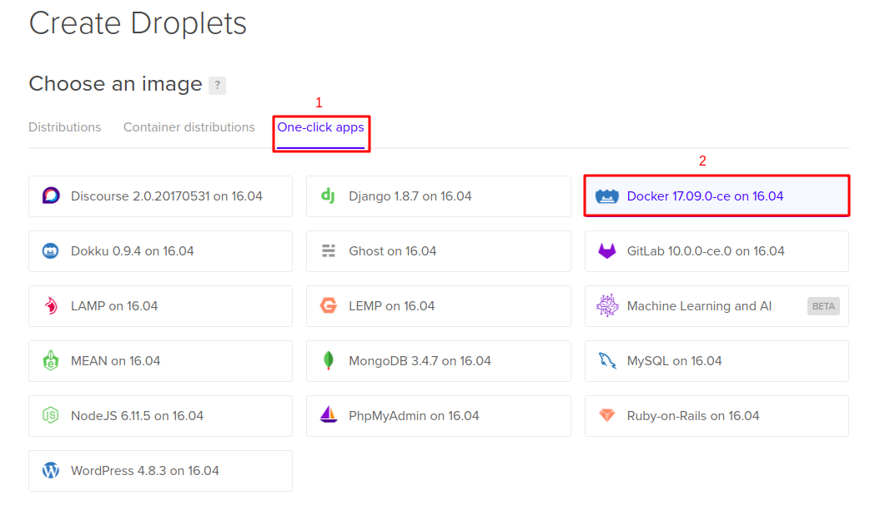
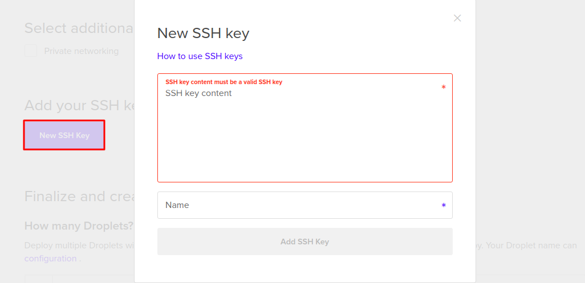
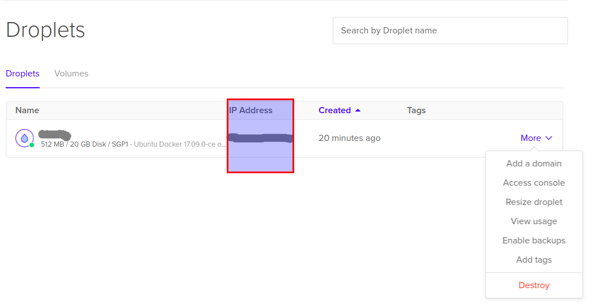
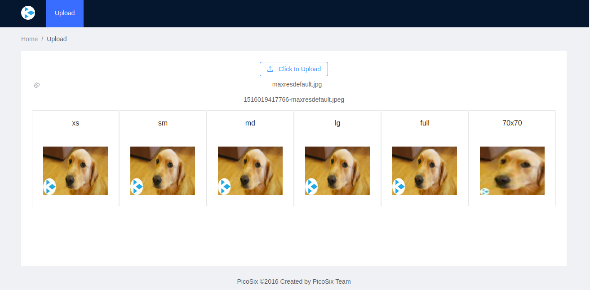

# Deploy project lên VPS (Digital Ocean)

## Bài trước đó

[Tái cấu trúc code](./11-refactor-code-structure.md)

## Mua VPS

Các bạn có thể chọn nhà cung cấp VPS mà bạn thích, riêng mình thì chọn DigitalOcean cho mục đích viết các bài hướng dẫn vì

* Setup nhanh
* Admin panel đơn giản và dễ sử dụng với người mới
* Có nhiều hướng dẫn

Nếu các bạn quyết định chọn DigitalOcean giống mình thích cần chú ý là có thể hiện tại DigitalOcean đã ban thẻ Visa Vietcomnak (có thể là các loại thẻ và các ngân hàng khác). Cho nên các bạn nên mua thông qua Paypal để đảm bảo giao dịch thành công

## Tạo tài khoản và VPS

Đầu tiên bạn cần tạo một tài khoản của DigitalOcean. Bạn có thể dùng một trong hai link sau

* Ref: https://m.do.co/c/6c5e74788ad8 Với link này, khi bạn đăng ký, bạn sẽ được tặng $10 khi đăng ký, và mình sẽ được **$25**. Các bạn có thể ủng họ mình bằng link này để các mình có thể dùng server này để thực hiện các bài hướng dẫn.
* No ref: https://www.digitalocean.com/. Bạn có thể kiếm được **$25** cho tài khoản bằng cách làm theo hướng dẫn để lấy coupon từ **codeanywhere** tại đây https://blog.codeanywhere.com/announcing-partnership-with-digitalocean/

Tiếp theo bạn vào link này [DigitalOcean Droplets](https://cloud.digitalocean.com/droplets) để tạo droplet (VPS - bên DigitalOcean gọi là droplet, mình không biết tại sao :D). Nội dung gồm các phần

1. Choose an image. Chọn loại VPS mà bạn muốn tạo, lúc trưóc mình thường chọn VPS ubuntu, hiện tại thì DigitalOcean có mục **One-click apps** gồm những image đã được cấu hình sẵn rồi, mình chỉ việc click và sử dụng thôi. Bạn chọn image **Docker 17.09.0-ce on 16.04 ** như trong hình



2. Choose a size. Chọn kích thưóc VPS của bạn, gồm CPU, RAM, Disk, ... Với mục đích hướng dẫn học nên mình sử dụng size rẻ nhất **$5/mon**
3. Add block storage **BỎ QUA**. Chọn storage, hiện tại các bạn bỏ qua
4. Choose a datacenter region. Chọn nơi mà VPS được đặt, mình chọn Singapore
5. Select additional options **BỎ QUA**
6. Add your SSH keys **QUAN TRỌNG**. Bạn nên sử dụng SSH key để đăng nhập vàp VPS thay vì dùng username/password vì mục đích an toàn.

* Đầu tiên bạn cần tạo một ssh key bằng lệnh `$ ssh-keygen -t rsa`
* Bạn sẽ trả lời một số câu hỏi về tên, vị trí lưu ssh key, passphrase. Output sẽ giống như thế này (output mình copy trên [mạng](https://www.digitalocean.com/community/tutorials/how-to-set-up-ssh-keys--2))

```shell
ssh-keygen -t rsa
Generating public/private rsa key pair.
Enter file in which to save the key (/home/demo/.ssh/id_rsa):
Enter passphrase (empty for no passphrase):
Enter same passphrase again:
Your identification has been saved in /home/demo/.ssh/id_rsa.
Your public key has been saved in /home/demo/.ssh/id_rsa.pub.
The key fingerprint is:
4a:dd:0a:c6:35:4e:3f:ed:27:38:8c:74:44:4d:93:67 demo@a
The key's randomart image is:
+--[ RSA 2048]----+
|          .oo.   |
|         .  o.E  |
|        + .  o   |
|     . = = .     |
|      = S = .    |
|     o + = +     |
|      . o + o .  |
|           . o   |
|                 |
+-----------------+
```

Sau đó bạn mở file `__HOME__/.ssh/id_rsa.pub`, copy nội dung trong đó và dán vào form như hình bên dưới



6. Click **Create** và đợi tầm 5-10 để DigitalOcean thiết lập các cấu hình cho bạn.
   Sau đó bạn có thể đăng nhập vào VPS bằng câu lệnh `$ ssh root@__YOUR_IP__`. Bạn sẽ thấy output như thế này

```shell
Welcome to Ubuntu 16.04.3 LTS (GNU/Linux 4.4.0-98-generic x86_64)

 * Documentation:  https://help.ubuntu.com
 * Management:     https://landscape.canonical.com
 * Support:        https://ubuntu.com/advantage

  Get cloud support with Ubuntu Advantage Cloud Guest:
    http://www.ubuntu.com/business/services/cloud

0 packages can be updated.
0 updates are security updates.


-------------------------------------------------------------------------------
Thank you for using DigitalOcean's Docker Application.

Docker has been preinstalled and configured per Docker's Recommendations.

"ufw" has been enabled. All ports except 22 (SSH), 80 (http) and 443 (https)
have been blocked by default.

'docker-compose' is installed in Docker container and is executed via
 /usr/local/bin/docker-compose. On your first run, the container
will be downloaded. To upgrade docker-compose version, edit
/usr/local/bin/docker-compose and change the version string.

-------------------------------------------------------------------------------

You can learn more about using this image here: http://do.co/docker

-------------------------------------------------------------------------------
To delete this message of the day: rm -rf /etc/update-motd.d/99-one-click

The programs included with the Ubuntu system are free software;
the exact distribution terms for each program are described in the
individual files in /usr/share/doc/*/copyright.

Ubuntu comes with ABSOLUTELY NO WARRANTY, to the extent permitted by
applicable law.
```

Nếu bạn không biết tìm IP VPS của bạn ở đâu thì có thể vào link [DigitalOcean Droplets](https://cloud.digitalocean.com/droplets) và tìm VPS mà bạn vừa mới tạo



## Deploy code từ Github lên VPS

Bạn cần clone project từ [p6-static](https://github.com/picosix/p6-static). Đây là bản production mà mình đã refactor code lại như [Bài 11](https://github.com/picosix/p6-static-example/blob/master/document/11-refactor-code-structure.md)

```shell
# cd /home/ && mkdir projects && cd projects && git clone https://github.com/picosix/p6-static.git && cd p6-static/
```

Vấn đề quan trọng tiếp theo của các bạn là trên VPS của các bạn không có các docker image mà mình đã hướng dẫn cáci bạn tạo :D Cho nên ở đây mình sẽ sử dụng những image mà mình đã public lên [Docker Hub](https://hub.docker.com/). Nếu các bạn muốn sử dụng image do các bạn tạo ra thì các bạn có thể làm theo hướng dẫn tại đây [Pushing and Pulling to and from Docker Hub
](https://ropenscilabs.github.io/r-docker-tutorial/04-Dockerhub.html)

## Khởi chạy các docker container

* Chạy `mongo` (mình dùng `mongodb` thay vì json): `# docker run -d --restart always --name mongo -p 27017:27017 -v $(pwd)/backup:/backup mongo:3`
* Chạy `nginx-proxy`: `# docker run -d --restart always --name nginx-proxy -p 80:80 -p 443:443 -v $(pwd)/certs:/etc/nginx/certs -v /var/run/docker.sock:/tmp/docker.sock:ro picosix/nginx-proxy`
* Cài đặt các module của project `# docker run --rm -v $(pwd):/app picosix/node yarn install`
* Copy file `.env` # cp .env.example .env`và chỉnh lại các config mà bạn muốn`# nano .env`. Sau khi chỉnh sửa xong thì các bạn`Ctrl + o`và`enter`để lưu lại file,`Ctrl + x` để thoát
* Chạy `node` app `# docker run -d -e SERVICE_HOST=static.picosix.p6app -e DB_DATABASE=picosix --restart always --name p6-static-node -v $(pwd):/app --link mongo:mongo picosix/node yarn start`
* Chạy `nginx`: `# docker run -d -e VIRTUAL_HOST=static.picosix.p6app --restart always --name p6-static-nginx -v $(pwd)/docker/nginx:/etc/nginx/conf.d/ -v $(pwd):/app --link p6-static-node:p6_static_node picosix/nginx`

Ở đây chỉ để demo nên mình dùng domain ảo khi khởi tạo `nginx` container (`VIRTUAL_HOST=static.picosix.p6app`). Để có thể sử dụng được domain ảo này, các bạn cần thêm dòng sau vào file `/etc/hosts`

```
__YOUR_IP__	static.picosix.p6app
```

vở **YOUR_IP** là ip VPS của bạn. Sau đó các bạn có thể vào domain mà chúng ta vừa tạo [static.picosix.p6app](http://static.picosix.p6app/) để xem kết quả

## Test

Thế giờ chúng ta làm sao để test khi mà mình chỉ viết api? Bạn có hai lựa chọn

* Tự viết một client đơn giản bằng HTML để test function upload
* Dùng demo mình viết sẵn để test [DEMO](http://static.picosix.info/demo/index.html). Demo này có sẵn trong project [p6-static](https://github.com/picosix/p6-static), cho nên các bạn có thể tự test trên VPS của mình bằng đường link `http://__YOUR_DOMAIN__/demo/index.html`

Lưu ý: Vì giới hạn của server, bạn chỉ nên upload ảnh với kích thước **FULL HD** (1920px/1200px) trở xuống



## Kết luận

Vậy là mình đã hướng dẫn xong các bạn phần deploy code lên VPS. Bài này cũng sẽ là bài kết thúc series hướng dẫn đầu tiên mình viết bằng tiếng Việt. Một số vấn đề còn tồn đọng lại cần các bạn hoàn thiện

* Giới hạn một sô thông số khi upload ảnh (kích thước, loại file khác nhau, ...)
* Viết thêm một số API như liệt kê tất cả các file ảnh đã được upload, xoá một số file cache, tạo cache cho một file, ...
* Phân quyền trên API

Mình vẫn sẽ tiếp tục cập nhật tính năng cho respo này nhằm phục vụ cho series thứ hai của mình [Xây dựng project thực tế - web tuyển dụng](https://github.com/picosix/p6-job)

Mong rằng qua series này các bạn có thể nắm được một số bước để thật sự tạo nên ứng dụng của riêng mình. Vì là series đầu nên mình viết có thể còn chưa tốt, nếu các bạn có mong muốn gì trong series tới, bạn có thể yêu cầu ở đây [Feedback](https://github.com/picosix/p6-job/issues/2).

Chúc các bạn năm mới vui vẻ :D
